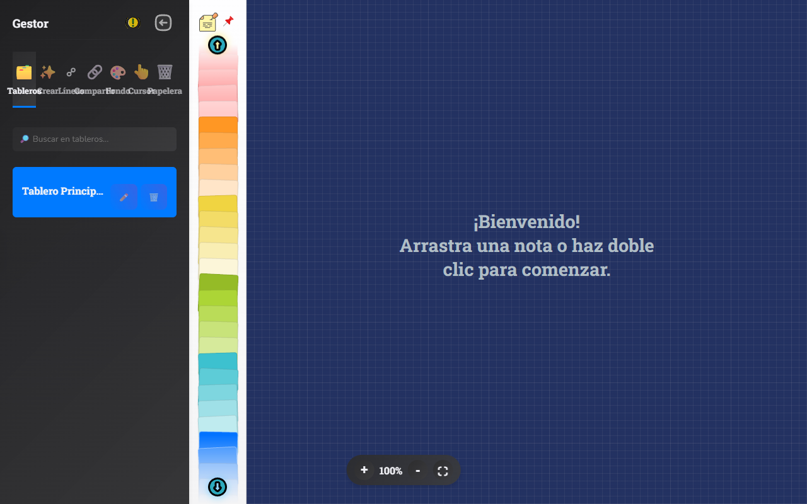
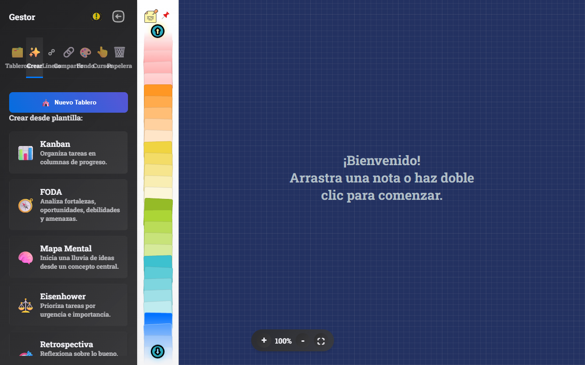
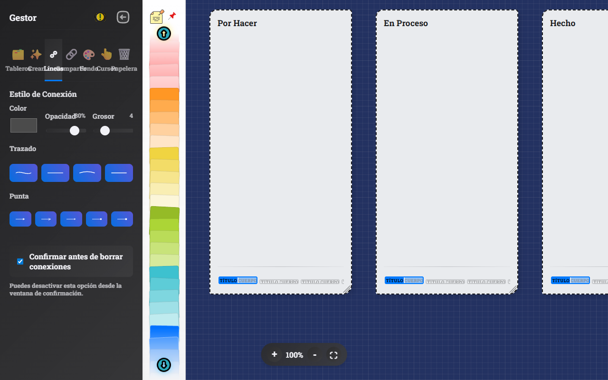
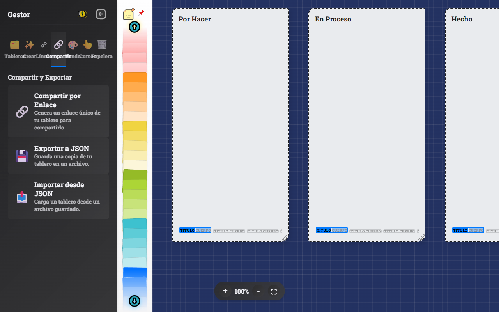
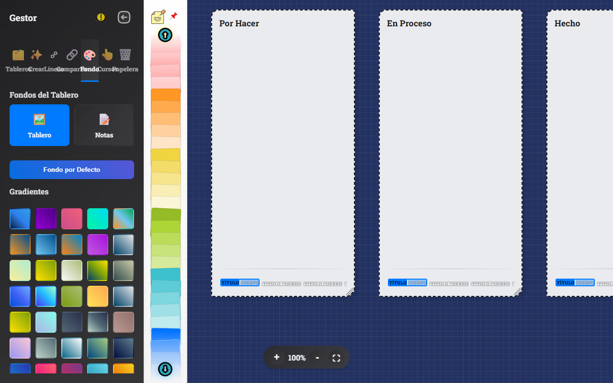
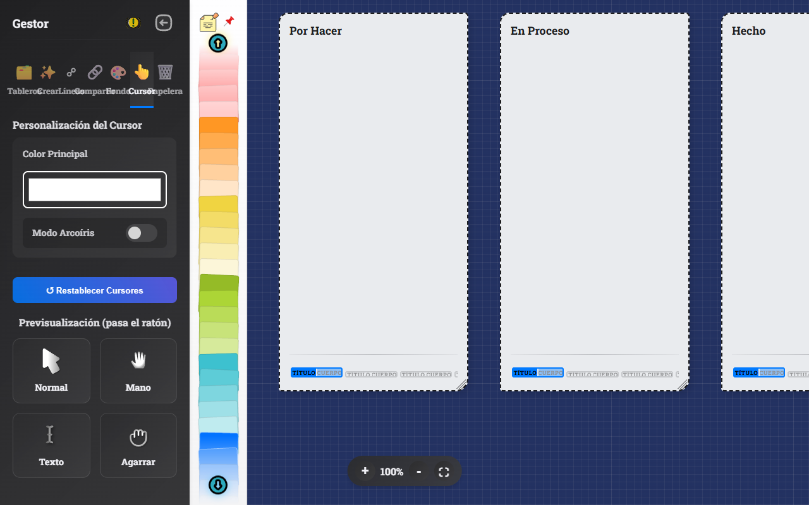
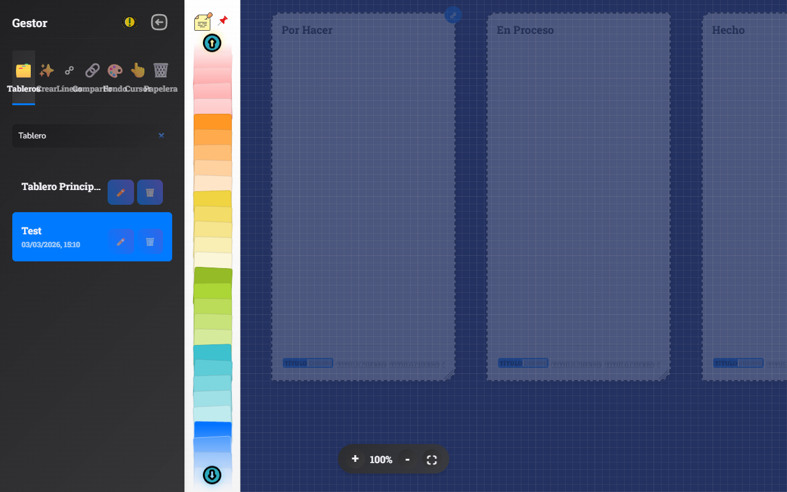
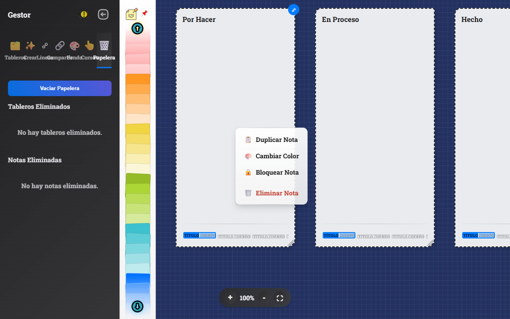
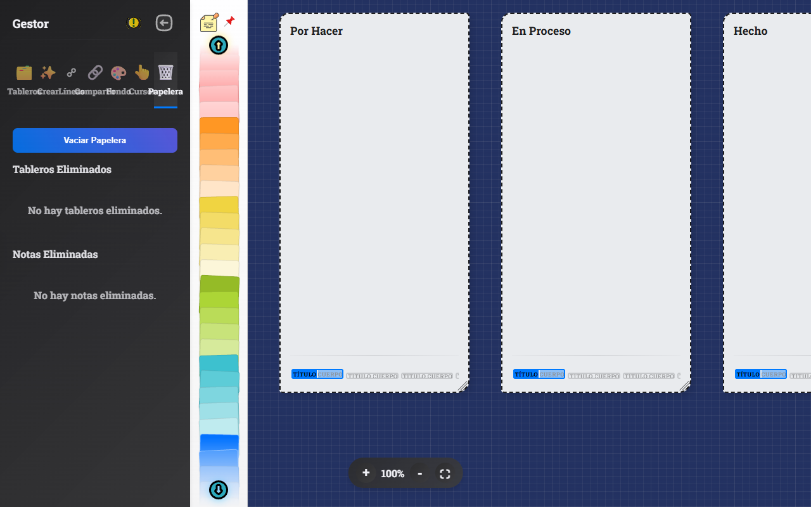
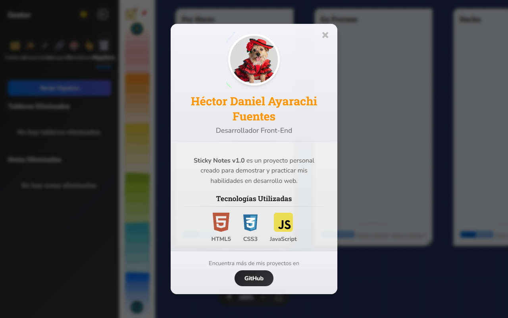

# 📝 Tablero de Notas Adhesivas Interactivo

¡Bienvenido al **Tablero de Notas Adhesivas Interactivo**! Una aplicación web dinámica, hermosa y altamente personalizable diseñada para ayudarte a organizar tus ideas, gestionar proyectos y colaborar de forma visual. Desde un simple tablero Kanban hasta un complejo mapa mental, esta herramienta te da la libertad de crear sin límites.



---

## ✨ Características Principales

*   📱 **Gestión de Múltiples Tableros:** Crea y organiza diferentes espacios de trabajo para cada uno de tus proyectos, sin perder el contexto.
*   🧠 **Notas Adhesivas Inteligentes:** Cada nota cuenta con 5 pestañas internas, permitiéndote separar título y cuerpo, para una organización más detallada.
*   🚀 **Creación Rápida y Plantillas:** Inicia un tablero en blanco o utiliza plantillas predefinidas (Kanban, Análisis FODA, Matriz de Eisenhower) para empezar a trabajar al instante.
*   🔗 **Conexiones Visuales:** Conecta ideas y tareas trazando líneas entre las notas. Personaliza el grosor, color, trazado de curva y estilo de punta.
*   🎨 **Personalización Avanzada:** Cambia el color de cada nota mediante un popover visual y modifica el fondo de tus tableros a nivel individual o general usando gradientes, patrones y capas.
*   🖱️ **Cursores Personalizados y Modo Arcoíris:** Modifica tu cursor para brindarle diversión a la experiencia de usuario y añade un modo arcoíris animado.
*   🔎 **Búsqueda Global Rápida:** Encuentra cualquier texto dentro de cualquier nota y tablero en tiempo real, gracias a un buscador potente.
*   🗑️ **Papelera de Reciclaje Segura:** Las notas y tableros eliminados se van a la papelera, desde donde puedes restaurarlos o eliminarlos permanentemente.
*   🌐 **Exportar e Importar:** Guarda tus tableros localmente exportándolos a JSON, o impórtalos para continuar trabajando en otro momento.
*   🎛️ **Controles de Zoom y Paneo:** Acércate a los detalles (+), aléjate (-) o mueve libremente el lienzo infinito.

---

## 🚀 Tour por la Aplicación

A continuación, te mostramos las principales interfaces y funcionalidades destacadas de la aplicación:

### 1. Paleta de Notas Rápida
Arrastra y suelta notas de colores predeterminados rápidamente desde el panel derecho hacia el tablero para empezar a mapear tus ideas.


### 2. Gestor de Tableros
Administra tus espacios de trabajo: renombra, elimina y visualiza todos los tableros activos de un vistazo.


### 3. Plantillas de Creación
Usa el menú de "Crear" para invocar componentes complejos, como *Prioridades*, *Matriz FODA* o *Kanban* inmediatamente sobre tu lienzo.



### 4. Estilo de Líneas y Mapeo
Configura de forma granular las conexiones visuales (color, patrón, formas, puntas de flecha) para crear mapas conceptuales vibrantes.



### 5. Compartir y Exportar a JSON
Comparte tu estado de trabajo exportándolo en un archivo `.json` que puedes restaurar sin depender de bases de datos.



### 6. Fondos Personalizables
Cambia el tapiz visual de tu espacio de trabajo. Puedes aplicar el diseño general al fondo principal o texturizar las notas individualmente.



### 7. Configuración de Cursores Animados
¡Un toque de diversión! Cambia el color de tu puntero, y activa el exclusivo "Modo Arcoíris" con controles de velocidad.



### 8. Búsqueda Global y Resaltado
Al introducir términos en la barra de búsqueda (pestaña Tableros), la aplicación resaltará las coincidencias tanto en el gestor lateral como en el tablero en tiempo real.



### 9. Contextual Menú y Bloqueo
Haz clic derecho sobre cualquier nota para duplicarla, bloquearla, cambiarle color o manipular todas sus líneas conectadas.



### 10. Papelera de Reciclaje
Arrastra notas a la papelera o revisa los archivos temporales eliminados para evitar pérdida de datos. ¡Todo es reversible antes del vaciado final!



### 11. Sobre el Desarrollador
Explora el hermoso modal de información, con música dedicada, animaciones y visor visual. ¡Escrito todo a mano!



---

## 🛠️ Tecnologías Utilizadas

*   **HTML5:** Para la estructura semántica de la interfaz.
*   **CSS3 Vanilla:** Implementación de *Glassmorphism*, Variables CSS, animaciones fluidas, y total customización visual de la aplicación.
*   **JavaScript (ES6+):** Lógica del cliente limpia, importación modular y manipulación en tiempo real del DOM.
*   **Leader-Line.js:** Poderosa y confiable librería para el renderizado fluido de líneas de conexión a lo largo de nodos HTML.
*   **Gráficos en SVG y Canvas:** Utilizados para visualización eficiente de selectores e íconos interactivos escalables libres de artefactos.

---

## 📦 Instalación y Uso Local

Para usar y testear localmente en tu red, sigue estos 3 simples pasos:

1.  **Clona el repositorio:**
    ```bash
    git clone https://github.com/HectorDanielAyarachiFuentes/Sticky-Notes.git
    ```
2.  **Navega a la carpeta del proyecto:**
    ```bash
    cd Sticky-Notes
    ```
3.  **Lanza la Aplicación:**
    No hay *build step*, y no se necesita empaquetado; simplemente inicializa un servidor web simple (como Live Server en VS Code o `npx serve`) y abre el archivo `index.html`.

¡Y voilà! Todas las funciones, ajustes y variables predeterminadas estarán encendidas para crear.

---

## 👨‍💻 Autor

**Hector Daniel Ayarachi Fuentes** 
* Visita mi GitHub: [HectorDanielAyarachiFuentes](https://github.com/HectorDanielAyarachiFuentes)